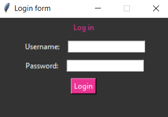

# Log in with Tkinter

This is a simple log in form created using Python and Tkinter GUI library.

## How to Play

1. Clone this repository to your local machine.

2. Make sure you have Python installed on your system.

3. Run the src/main.py file to start.

## Dependencies

- Python 3.x

- Tkinter

## Screenshots

## Author

zahra fouladian

## License

This project is licensed under the MIT License - see the [LICENSE.md](LICENSE.md) file for details.