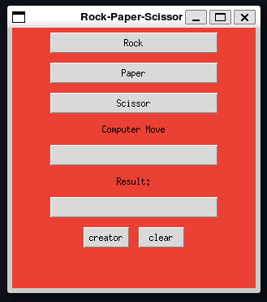

# Rock Paper Scissors with Tkinter

This is a simple Rock Paper Scissors game created using Python and Tkinter GUI library.

## How to Play

1. Clone this repository to your local machine.

2. Make sure you have Python installed on your system.

3. Run the src/main.py file to start the game.

4. Click on one of the buttons to choose your move (Rock, Paper, or Scissors).

5. The computer will randomly choose its move.

6. The winner will be displayed on the screen.

## Dependencies

- Python 3.x

- Tkinter

## Screenshots

## Author

zahra fouladian

## License

This project is licensed under the MIT License - see the [LICENSE.md](LICENSE.md) file for details.