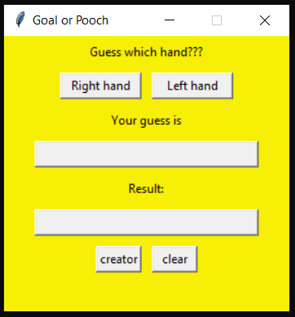

# Goal or Poach Game with tkinter
## Overview

This project ia a simple game called "Goal or Poach" implemented using the tkinter library in Python


## How to Run

1. Navigate to the main project directory (`goal_or_pooch`).
2. Run the `main.py` script:
```bash
python src/main.py
```
## Dependencies


- Python 3.x

- Tkinter


## Screenshots





## Author


zahra fouladian


## License


This project is licensed under the MIT License - see the [LICENSE.md](LICENSE.md) file for details.