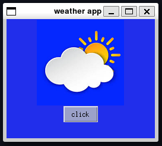

# Weather app with tkinter
## Overview

This project ia a simple Weather app implemented using the tkinter library in Python


## How to Run

1. Navigate to the main project directory (`weather_app`).
2. Run the `main.py` script:
```bash
python src/main.py
```
4. By clicking on the button, it shows the temperature of the Nowshahr city at the moment.

## Dependencies

- Python 3.x

- Tkinter


## Screenshots





## Author


zahra fouladian


## License


This project is licensed under the MIT License - see the [LICENSE.md](LICENSE.md) file for details.